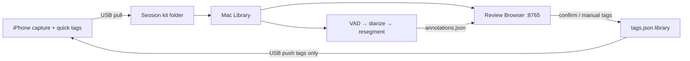
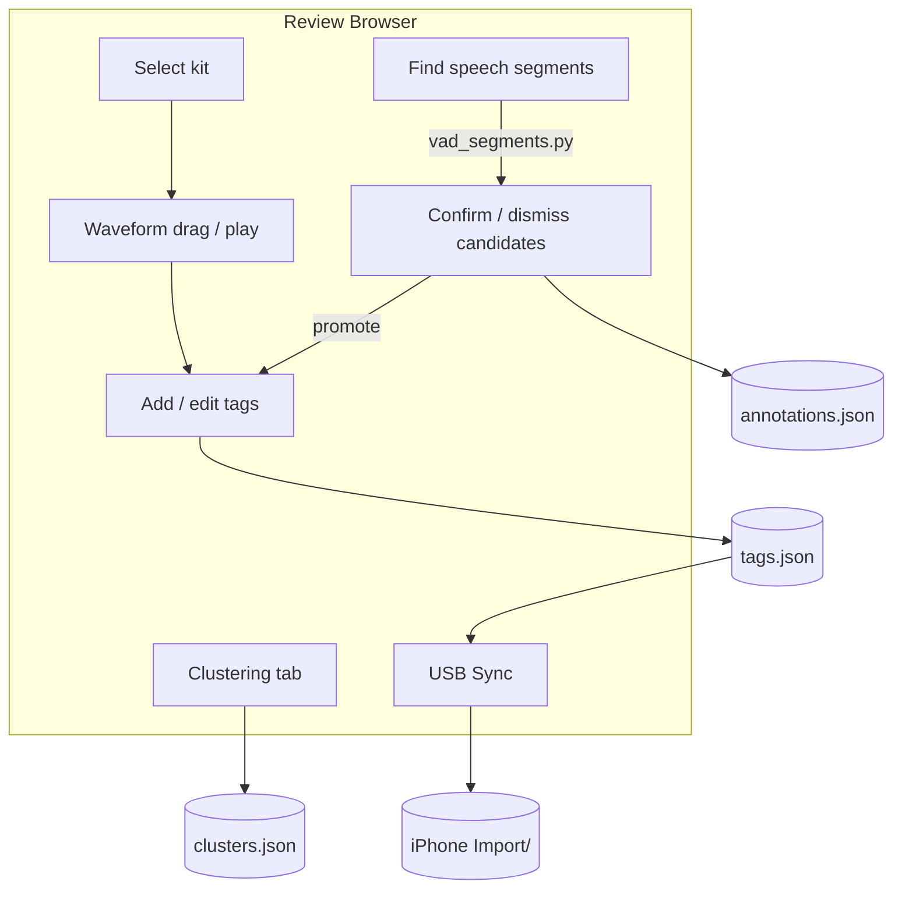
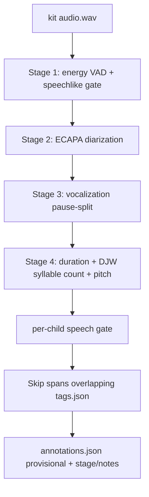

# BabyTalk — System Architecture

**Updated:** 2026-07-29  
**Workspace branch:** `cursor/iou-improvements` (1 commit ahead of `main`: VTC-first segmentation)  
**Also documents:** uncommitted worktree changes on that branch (review UI theme, supervised launcher, analysis sweeps)  
**Related docs:** phone waveform deep dive in [`ARCHITECTURE_DEEP_DIVE.md`](./ARCHITECTURE_DEEP_DIVE.md); Mac ops detail in [`../tools/README.md`](../tools/README.md); product phasing in [`PRODUCT_ROADMAP.md`](./PRODUCT_ROADMAP.md)

This is the maintainable system map for **phone capture → Mac review → tags/library**. Numbers below are from checked-in or worktree analysis JSON under `tools/analysis/out/` — not invented.

### Status legend

| Marker | Meaning |
|--------|---------|
| **main** | On `main` today (tip ≈ merge-base `80063ee` — DJW resegment + ECAPA ML path + Review Browser) |
| **branch** | Committed on `cursor/iou-improvements` only (`ad849e3` — VTC / `vtc-first`) |
| **WIP** | Present in the working tree but **not committed** (experimental / not merged) |

---

## 1. Product purpose

BabyTalk is a personal research instrument: capture a child’s vocalizations on phone, keep durable session kits, and grow a structured tag library (words, phonetics, categories, speakers) for later modeling.

| Layer | Job |
|-------|-----|
| **Phone (React Native)** | Record ALAC/WAV sessions, live + Path-B waveforms, quick tags, export session kits, USB File Sharing |
| **Mac Review Browser** | Listen, drag-span tag, confirm/dismiss ML candidates, cluster similar sounds, USB sync |
| **Mac ML tools** | Propose tag-sized candidates (`annotations.json`); never overwrite confirmed human labels |

Near-term thesis: the **labeling flywheel** (propose → confirm → better proposals) runs on the Mac; the phone stays the capture + quick-tag edge. Google Drive / cloud ML are out of scope for now.



---

## 2. What’s on `main` vs this branch

### On `main` today

- RN app: record / playback / Path B peaks / session naming / category+speaker+word+phonetic tagging
- Session kits under `~/Documents/BabyTalk/Library/` + USB sync (`tools/iphone_sync.py`)
- Review Browser (`tools/review_server.py`): waveform tagging, ML candidates, Clustering tab, Sync button
- ML SoTA path (Review default): **energy VAD + speechlike gate → ECAPA diarization → vocalization pause-split (`VOCALIZATION_PAUSE_MS`) → features (duration / DJW syllable count / pitch) → annotations**. Legacy `--unit word` keeps DJW + merge-back for clustering experiments.
- Supporting modules: `vad_segments.py`, `speechlike.py`, `diarize.py`, `resegment.py`, `vocalization_features.py`, `cluster_sounds.py`, `asr_suggest.py`
- Benchmark harness (partial): `tools/analysis/ml_delta.py`

### On branch `cursor/iou-improvements` (committed)

- `tools/vtc.py` — LAAC-LSCP Voice Type Classifier wrapper
- `--segmentation vtc-first` and `--diarization vtc` in `vad_segments.py`
- Review / README wiring for VTC backends
- Extended `ml_delta.py` for fresh runs + segmentation flags

**Verdict from benchmarks (below):** keep **ECAPA** as default stage-2; do **not** replace it with VTC on these phone-mic kits.

### WIP (worktree, uncommitted)

- Supervised launcher `tools/run_review_server.sh` (survives agent shell deaths)
- Dark theme with **Auto = evening/night** (18:00–06:00) + Light/Dark cycle
- Tags list **scroll viewport** (`.tag-rows` ≈ 20 compact rows, `overflow-y: auto`)
- Analysis: `iou_sweep.py`, `role_delta.py`, outputs under `tools/analysis/out/`
- `resegment.py` parameter plumbing for word-split knobs (defaults unchanged; enables sweeps)

---

## 3. Mac Review Browser

**Entry points**

| Mode | Command | Status |
|------|---------|--------|
| Supervised (preferred) | `tools/run_review_server.sh` → http://127.0.0.1:8765 | **WIP** |
| Direct | `python3 tools/review_server.py` | **main** |
| Status / stop / restart | `tools/run_review_server.sh --status\|--stop\|--restart` | **WIP** |

Log: `tools/.run/review_server.log`. Kits default to `~/Documents/BabyTalk/Library/` (seeded from `Backups/` on first launch).

**UI behaviors**

- Live writes to each kit’s `tags.json` on Add / Save / Delete
- **Sync with iPhone** — pull kits, push `manifest.json` + `tags.json` only (**main**)
- **Theme:** Auto (evening/night dark) → Light → Dark (**WIP**; `localStorage` key `babytalk-review-theme`)
- **Tags panel:** compact one-line rows; open row expands editor; scroll clamped to ~20 rows (**scroll height WIP**; compact list **main**)
- Tabs: session review (waveform + ML candidates) + **Clustering**
- Optional Whisper **Suggest** on a span (`asr_suggest.py` / faster-whisper) — does not overwrite `word`/`phonetic` until Copy→word



---

## 4. ML candidate pipeline (SoTA path)

Default path (Review **Find speech**):



Legacy `--unit word` still runs pause-split → DJW + merge-back → word-like children (Clustering experiments).

CLI:

```bash
tools/.venv/bin/python tools/vad_segments.py ~/Documents/BabyTalk/Library
tools/.venv/bin/python tools/vad_segments.py <kit> --list-backends
tools/.venv/bin/python tools/vad_segments.py <kit> --unit word   # legacy word-like
```

Defaults: `unit=vocalization`, pause ≥ **400 ms** (`VOCALIZATION_PAUSE_MS`, tunable), VAD merge gaps ≤ 200 ms, dual-threshold edge pad. Source `vad_v0`. Re-runs replace still-provisional VAD candidates only; confirmed/dismissed/skipped + existing tags are preserved.

### 4.1 Stage 1 — VAD + speechlike gate (**main**)

| Piece | File | Role |
|-------|------|------|
| Energy VAD | `vad_segments.py` | “Louder than the room?” |
| Speech gate | `speechlike.py` | “Vocal-tract-like?” — voicing peak / voiced fraction / speech-band / low-band |

Score = `0.40·speech_band + 0.25·voicing_peak + 0.15·voiced_fraction + 0.20·(1 − low_band)`.

| Threshold | Behavior |
|-----------|----------|
| Region screen &lt; **0.42** | Drop whole region before diarization (lenient) |
| Candidate &lt; **0.55** | Drop |
| **0.55–0.68** | Keep, flag `possible_non_speech`, down-rank |
| ≥ **0.68** | Clean pass |

**Calibration (speech vs noise / dismiss):** AUC **~0.81** on 457 reviewer-confirmed (206) / dismissed (251) spans; per-kit 0.77 / 0.83 / 0.88 (`speechlike.py` docstring, `tools/README.md`). Logistic re-fit was worse (LOKO AUC 0.79). Syllabic modulation 2–10 Hz AUC 0.46 — discarded.

**“Worth tagging” is a different problem.** After the gate, leftover false positives (candidates with no tag overlap on curated fresh kits) are **~47.9%**, and `speechScore` AUC for hit-vs-miss tags is only **~0.53** (`tools/analysis/out/ml_delta_fresh.json` → `pooledFreshCurated`). Retuning the speechlike threshold will not solve worth-tagging.

### 4.2 Stage 2 — Diarization (**main** + VTC **branch**)

Sliding 1.5 s windows → embeddings → cosine agglomerative clustering → cut on cluster change. Writes `speakerCluster` (`SPEAKER_00`, …) — **not** the reviewer `speaker` field (Confirm still asks).

| Backend | Status | Notes |
|---------|--------|-------|
| **`ecapa`** | **main** default | SpeechBrain ECAPA-TDNN; ~80 MB cache; no HF token |
| **`melstats`** | **main** fallback | MFCC mean+std; weak (can split one child into many speakers) |
| **`pyannote`** | **main** opt-in | Needs `BABYTALK_HF_TOKEN`; never auto-selected |
| **`vtc` / `vtc-first`** | **branch** | Role labels KCHI/OCH/FEM/MAL → Baby/Parent/Other; needs local VTC checkout |

```bash
# Keep energy VAD; swap diarizer only
tools/.venv/bin/python tools/vad_segments.py <kit> --diarization vtc

# Skip VAD+ECAPA; use VTC role timeline as parent spans
tools/.venv/bin/python tools/vad_segments.py <kit> --segmentation vtc-first
```

#### Why VTC failed as stage-2 / vtc-first on these kits

**Segment quality (curated fresh, ECAPA default vs `vtc-first`):**

| Metric | ECAPA path (`ml_delta_fresh.json`) | VTC-first (`ml_delta_vtc.json`) |
|--------|--------------------------------------|----------------------------------|
| Tag any-overlap | **92.9%** | 41.7% |
| IoU≥0.5 | **50.0%** | 17.4% |
| Missed tags | **7.1%** (14/198) | **58.3%** (134/230) |
| nCands | 315 | 371 |

**Role accuracy (`role_delta.json`, pooled; n=228 tags with speaker):**

| System | Baby F1 | Adult F1 | Notes |
|--------|---------|----------|-------|
| VTC (direct roles) | **8.1** (R 4.2%) | **8.7** | ~52.6% miss; baby often → Adult/MISS |
| ECAPA + oracle cluster→class | Baby **96.7** | Adult **0.0** (n=4) | Upper bound if human maps clusters; baby/non-baby macro F1 **89.1** |

VTC was trained for LENA-style recorders, not close phone mics in home/hospital rooms. On this library it both **misses baby speech as segments** and **mis-labels roles**. Do not replace ECAPA with VTC for these kits.

### 4.3 Stage 3 — Vocalization pause-split (Review default) + legacy word path

**Product decision (Review):** discover **vocalization / turn** segments —
diarization + `VOCALIZATION_PAUSE_MS` (placeholder 400 ms) — not DJW word boxes.
DJW runs only for **syllable count** inside each window (`vocalization_features.py`).
Each annotation stores features + empty `stage` / `notes` for manual labeling
(see `docs/DEVELOPMENTAL_TIMELINE.md`).

**Legacy (`--unit word`):** discover **word-like** (tag-sized) segments via
pause-split + DJW + merge-back. Longer VAD/diarization regions remain parents
(`parentSpanId`). Whisper word boxes are **not** the word-box source
(see `docs/IOU_WHISPER_VS_MERGEBACK.md`).

1. Same-speaker spans &gt; **4 s** → deepest relative energy dip; hard cap **15 s** (`hard_capped`)
2. `resegment.py` — de Jong & Wempe (2009) syllable nuclei (Praat intensity + preceding dip + voicing), then BabyTalk word-like cut knobs:

| Knob | Default | Role |
|------|---------|------|
| `WORD_SPLIT_MIN_SEP_MS` | 300 | Cut if nuclei ≥ this far apart |
| `WORD_SPLIT_MIN_DIP_DB` | 4.0 | Or if valley prominence ≥ this |
| `RESEG_TARGET_MS` | 1600 | Force-split leftovers still longer |
| `RESEG_MIN_PART_MS` | 420 | Minimum child duration |

3. **Merge-back** (same module, default on): glue clearly-short sibling pieces
   across weak cuts — `require_clearly_short=True`, **`short_piece_ms=400`**,
   **`max_gap_ms=200`** (production; looser 450/300 remains not accepted;
   weak valley secondary only). Optional `mergedFrom` /
   `splitBy: merge_back`. Disable with `--no-merge-back`.

Children carry `parentSpanId`, `resegMethod: dejong_wempe`, `splitBy: syllable`
or `merge_back`. Disable DJW+merge-back with `--no-resegment`.

**IoU sweep (`tools/analysis/out/iou_sweep.json`, **WIP** tool):** best config **is the baseline** defaults above. Pooled **manual** IoU≥0.5 = **57.2%** (any overlap 95.2%; nManual=152, nCands=645). Tuning knobs did not beat defaults.

**Dominant failure mode was** over-split / too-short children (e.g. *tea|cher*).
**Merge-back is now in the production path** (short-gated 400 ms, max gap 100 ms).
Do not replace DJW with Whisper word timestamps.

### 4.4 Clustering tab (**main**)

`tools/cluster_sounds.py` — log-mel temporal fingerprints + sklearn agglomerative clustering → `clusters.json` (+ optional `cluster_embeddings.npz`). Groups similar *word-like* sounds **same-speaker** (manual tags + non-dismissed VAD); **SHORT** fragments (~400–500 ms kit-adaptive) are excluded from seeding by default — same philosophy as Find speech segments after merge-back. Labels live on the cluster.

**Known limitation:** mel summaries still lean on pitch / loudness / duration structure even with light peak normalize — weak for “same word, different prosody.” Contemplated (not built): HuBERT / wav2vec2 embeddings + propose-and-name UX.

---

## 5. Benchmarks & analysis tools

| Tool | Status | Purpose |
|------|--------|---------|
| `tools/analysis/ml_delta.py` | **main** (+ **branch** flags) | Tag↔candidate coverage, FP rate, speechScore AUC |
| `tools/analysis/role_delta.py` | **WIP** | VTC vs ECAPA-oracle role F1 |
| `tools/analysis/iou_sweep.py` | **WIP** | DJW word-split knob sweep vs manual IoU≥0.5 |

Outputs (examples used for this doc):

- `tools/analysis/out/ml_delta_fresh.json` — ECAPA SoTA fresh curated
- `tools/analysis/out/ml_delta_vtc.json` — `segmentation=vtc-first`
- `tools/analysis/out/role_delta.json`
- `tools/analysis/out/iou_sweep.json`

```bash
# Fresh ECAPA-path delta (read-only; never writes Library)
tools/.venv/bin/python tools/analysis/ml_delta.py --fresh \
  --out tools/analysis/out/ml_delta_fresh.json

# VTC-first comparison
tools/.venv/bin/python tools/analysis/ml_delta.py --fresh --segmentation vtc-first \
  --out tools/analysis/out/ml_delta_vtc.json

tools/.venv/bin/python tools/analysis/role_delta.py \
  --out tools/analysis/out/role_delta.json

tools/.venv/bin/python tools/analysis/iou_sweep.py \
  --out tools/analysis/out/iou_sweep.json
```

### Headline numbers (curated kits)

| Question | Answer | Source |
|----------|--------|--------|
| Speechlike separates speech vs junk? | AUC **~0.81** | `speechlike.py` / README |
| speechScore ranks “worth tagging”? | AUC **~0.53**; FP leftover **~48%** | `ml_delta_fresh.json` |
| ECAPA segment recall (any overlap) | **92.9%** | same |
| VTC-first any overlap | **41.7%**; miss **58%** | `ml_delta_vtc.json` |
| VTC Baby role F1 | **8.1** | `role_delta.json` |
| ECAPA-oracle Baby F1 | **96.7** | same |
| Best DJW knobs | **defaults**; manual IoU≥0.5 **57.2%** | `iou_sweep.json` |

---

## 6. Open priorities (ordered)

1. **Worth-tagging signal** — separate from speechlike. speechScore AUC ~0.53 / ~48% FP means the next filter should target “reviewer would tag this,” not another speech-vs-noise retune.
2. **Merge-back shipped** (short-gated 400 ms) — monitor verbal IoU; do not swap in Whisper word boxes.
3. **Clustering embedding upgrade** — HuBERT/wav2vec2 + propose-and-name UX; keep mel+sklearn until then.
4. **Not VTC-as-ECAPA-replacement** on these phone-mic kits — optional experiment only; default stays ECAPA.

Phone/Mac durability (kit schema, USB sync) is largely in place on **main**; polish continues in Review UI **WIP**.

---

## 7. Data model (session kit)

Library root: `~/Documents/BabyTalk/Library/<kit-folder>/`

| File | Role |
|------|------|
| `manifest.json` | Identity + audio metadata (`recordingUuid`, `sessionName`, `audioFile`, `durationMs`, codec/rate/channels, …) |
| `audio.wav` (or path in manifest) | Decoded master for Mac tools |
| `waveform.json` | Envelope for UI — **not** ML input |
| `tags.json` | Trusted human (and `ml_confirmed`) spans — USB push target |
| `annotations.json` | Provisional ML candidates (`source: vad_v0`, status provisional/confirmed/dismissed) |
| `clusters.json` | Acoustic clusters + labels (**optional**, from Clustering tab) |
| `cluster_embeddings.npz` | Optional embedding cache |

**Tag / annotation sketch**

```text
tags.json        { "tags": [ { uuid, startMs, endMs?, category, speaker?,
                               word?, phonetic?, note?, label, source, ... } ] }

annotations.json { "annotations": [ { uuid, startMs, endMs, status, source,
                                      speechScore?, speakerCluster?, flags?,
                                      parentSpanId?, resegMethod?, ... } ] }

clusters.json    { clusters: [ { id, label fields, member ids, confidence… } ] }
```

USB (**main**): pull full kits from phone `Documents/Backups/` → Mac Library; push `manifest.json` + `tags.json` → phone `Documents/Import/<kit>/`. Open BabyTalk on phone to auto-import.

---

## 8. Phone app (brief)

Deep file-tied walkthrough: [`ARCHITECTURE_DEEP_DIVE.md`](./ARCHITECTURE_DEEP_DIVE.md).

| Concern | Location |
|---------|----------|
| Record / Tag Now / Save + Path B | `src/screens/RecordScreen.tsx` |
| Playback + seek | `src/screens/PlaybackScreen.tsx` |
| Waveform envelope | `src/components/Waveform.tsx`, `src/waveform/` |
| SQLite | `src/db.ts` |
| Native audio + `extractWaveformPeaks` | `react-native-audio-recorder-player` (local fork) |

Path A = live metering; Path B = file-derived peaks after save / on playback load. On-screen bars are a **loudness envelope**, not PCM.

---

## 9. How to run (cheat sheet)

```bash
# One-time
cd /path/to/babytalkApp-1
python3 -m venv tools/.venv
tools/.venv/bin/pip install -r tools/requirements.txt

# Review UI (WIP launcher preferred)
tools/run_review_server.sh
open http://127.0.0.1:8765
# or: python3 tools/review_server.py

# ML candidates (ECAPA SoTA)
tools/.venv/bin/python tools/vad_segments.py ~/Documents/BabyTalk/Library

# USB
tools/.venv/bin/python tools/iphone_sync.py sync

# Analysis (read-only)
tools/.venv/bin/python tools/analysis/ml_delta.py --fresh --out tools/analysis/out/ml_delta_fresh.json
tools/.venv/bin/python tools/analysis/role_delta.py --out tools/analysis/out/role_delta.json   # WIP
tools/.venv/bin/python tools/analysis/iou_sweep.py                                            # WIP
```

Phone: see root [`README.md`](../README.md) / [`INSTALL_TO_IPHONE.md`](../INSTALL_TO_IPHONE.md).

---

## 10. File map (Mac tools)

```
tools/
├── review_server.py          # Review Browser (HTML+API)
├── run_review_server.sh      # Supervised launcher (WIP)
├── iphone_sync.py            # USB pull/push
├── vad_segments.py           # Pipeline orchestrator
├── speechlike.py             # Absolute speech gate
├── diarize.py                # ECAPA / melstats / pyannote
├── vtc.py                    # VTC roles (branch)
├── resegment.py              # DJW nuclei + short-gated merge-back (word-like)
├── cluster_sounds.py         # Mel + sklearn clustering
├── asr_suggest.py            # Optional Whisper
├── propose_candidates.py     # Legacy short-burst onsets
├── validate_export.py
├── requirements.txt
└── analysis/
    ├── ml_delta.py
    ├── role_delta.py         # WIP
    ├── iou_sweep.py          # WIP
    └── out/*.json            # Benchmark dumps (WIP / local)
```

---

## 11. Gaps / verification notes

- **HuBERT / propose-and-name:** product direction only; no implementation in tree yet.
- **tea|cher example:** failure-mode class inferred from IoU sweep (too-short / over-split, low `candTooLong2xPct`); not a single logged clip id in JSON.
- **Dark theme / Tags viewport / `run_review_server.sh` / `role_delta` / `iou_sweep`:** verified in worktree; confirm before treating as shipped.
- **`ml_delta_fresh.json` `segmentation`/`diarization` fields** were `null` in the dump header while metrics match the ECAPA SoTA path — treat coverage numbers as authoritative; re-run with explicit flags if you need stamped metadata.
- Phone export kit phases in older roadmap text are largely **done on main**; `ARCHITECTURE_DEEP_DIVE.md` §12 still describes some as “planned” — prefer this doc + `tools/README.md` for Mac/ML currency.
- Adult role support in `role_delta` is tiny (n=4 Adult tags) — Adult F1 comparisons are weak; Baby metrics dominate.
